# Produtiva

**Produtiva** is a productivity tracking application built with Python and Streamlit. It helps users monitor their task performance, visualize productivity trends through interactive dashboards, and generate detailed reports to optimize workflow and decision-making.

## Features

- 📊 **Interactive Dashboards:** Monitor productivity trends.
- ✅ **Task Management:** Add and update task data.
- 🔄 **Real-time Updates:** Instantly reflect changes in the data.
- 📅 **Monthly Tracking:** Keep track of tasks over time.

## Installation

1. **Clone the repository:**

   ```bash
   git clone https://github.com/pedrorigon/produtiva.git
   cd produtiva
   ```

2. **Install dependencies:**

   ```bash
   pip install -r requirements.txt
   ```

3. **Run the application:**

   ```bash
   streamlit run Home.py
   ```

The app will open in your browser at `http://localhost:8501`.

## Screenshots

| Overview Change Data Dashboard      | Overview Show Graph Dashboard        |
| ----------------------------------- | ------------------------------------ |
| 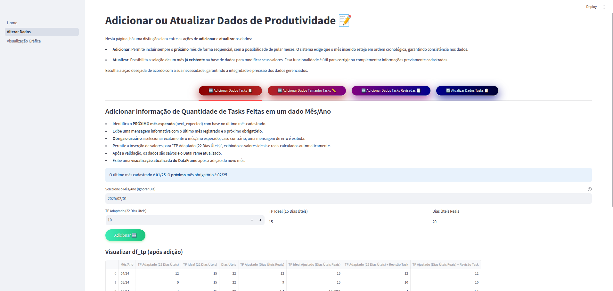 | 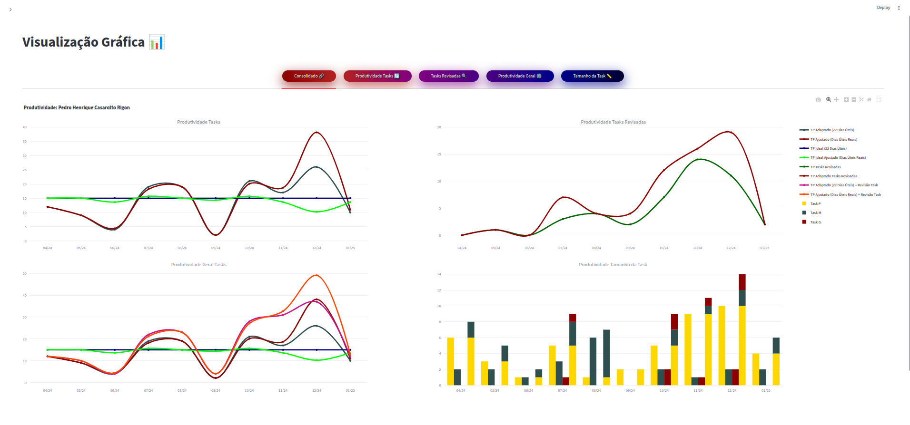 |

### Individual Graphs

| 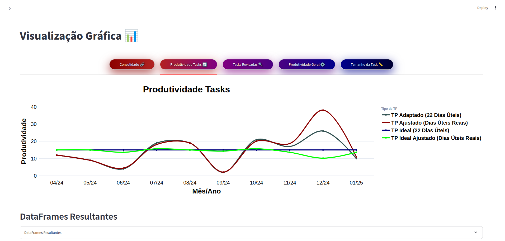 | 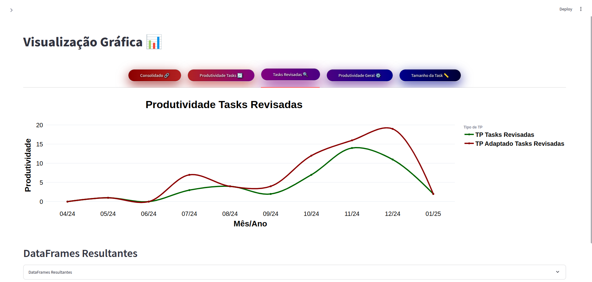 |
| ----------------------------- | ----------------------------- |
| 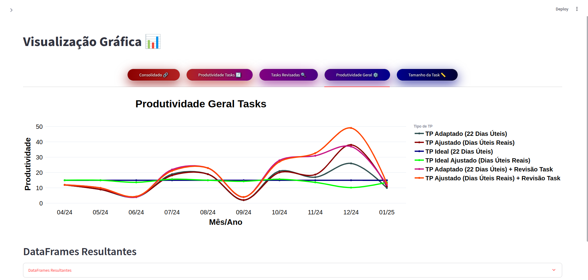 | 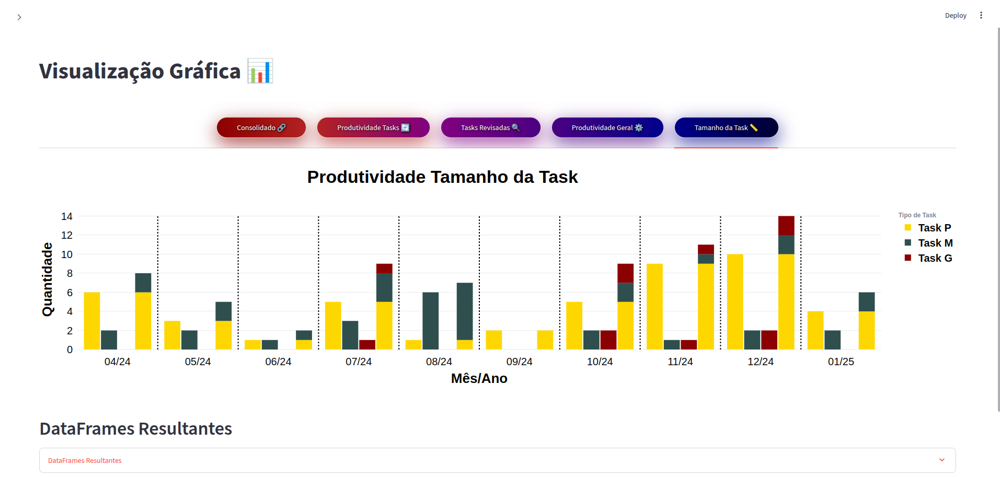 |

### Individual Final DataFrames

<p align="center">
  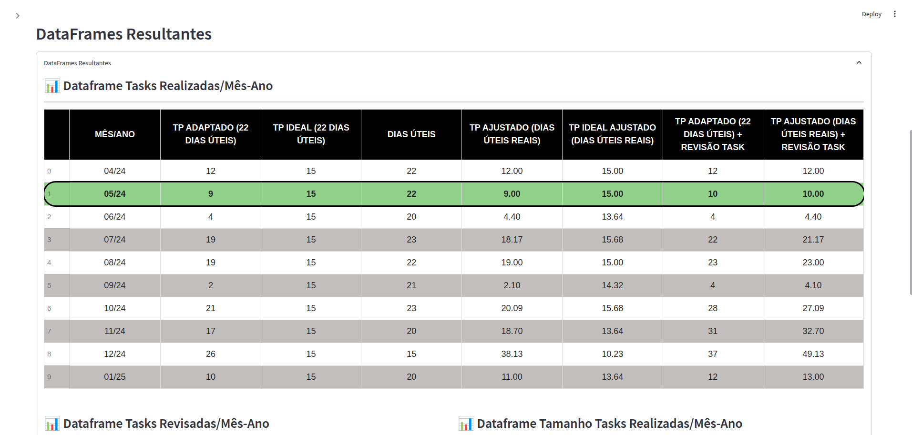
</p>

<p align="center">
  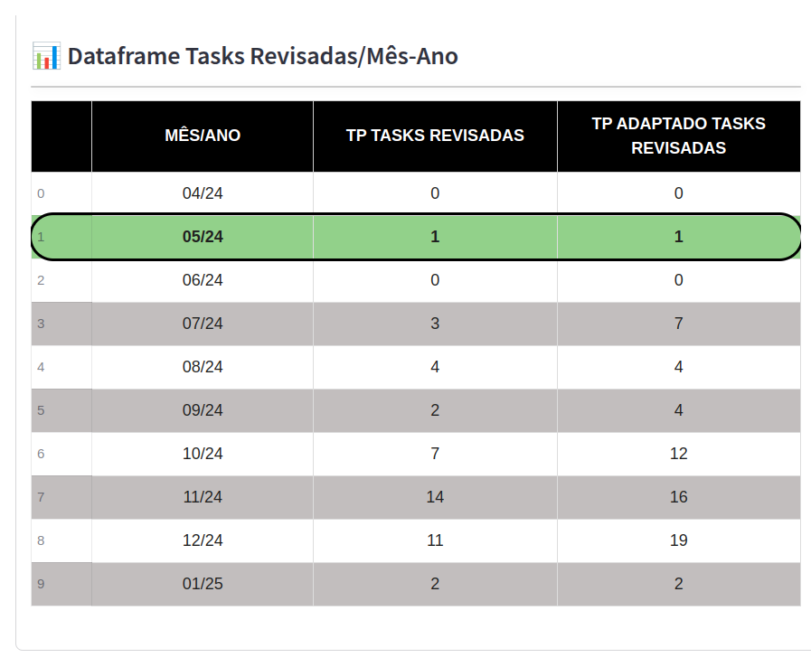
  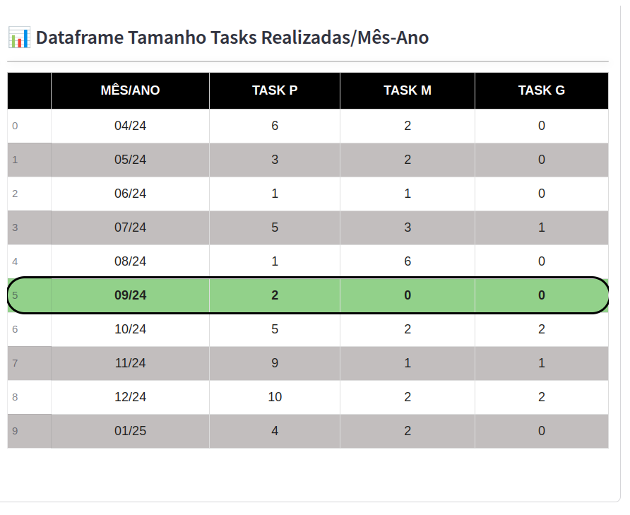
</p>

### Change Data Options

| 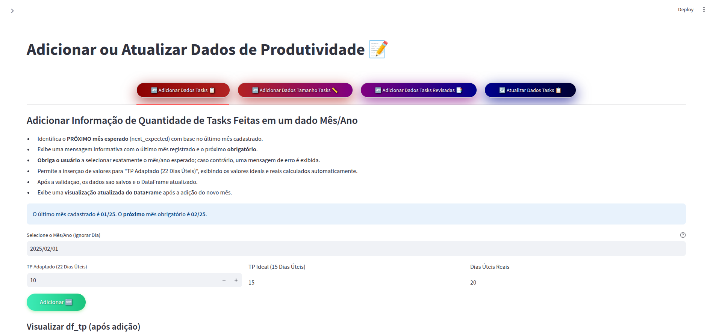 | 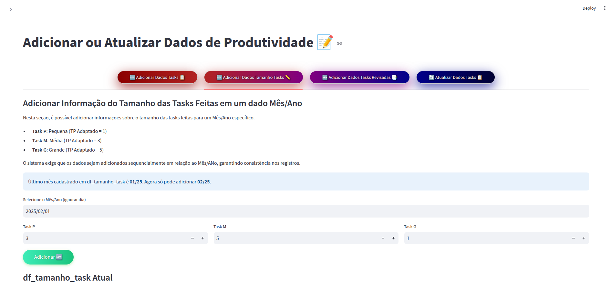 |
| -------------------------------------- | -------------------------------------- |
| 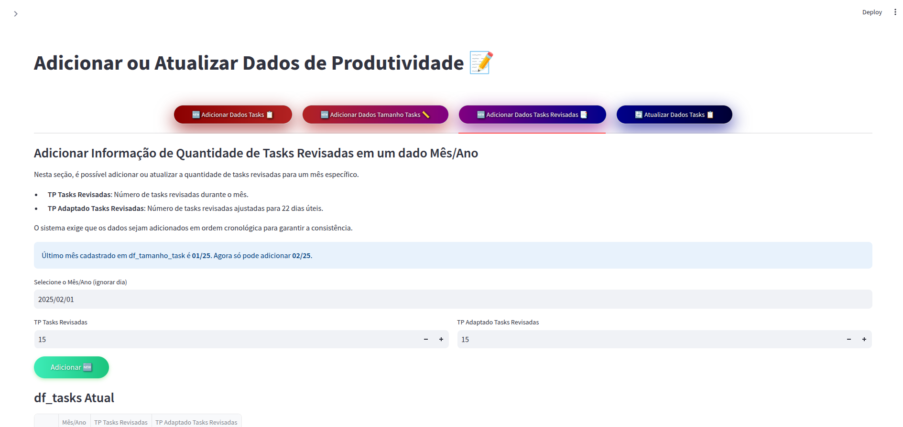 | 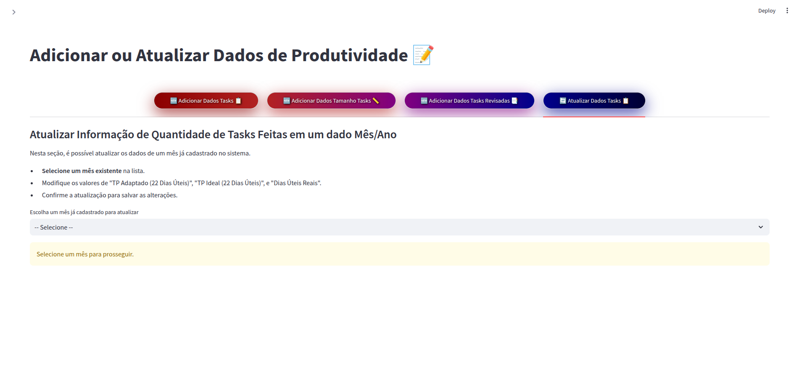 |

### Home Page

| 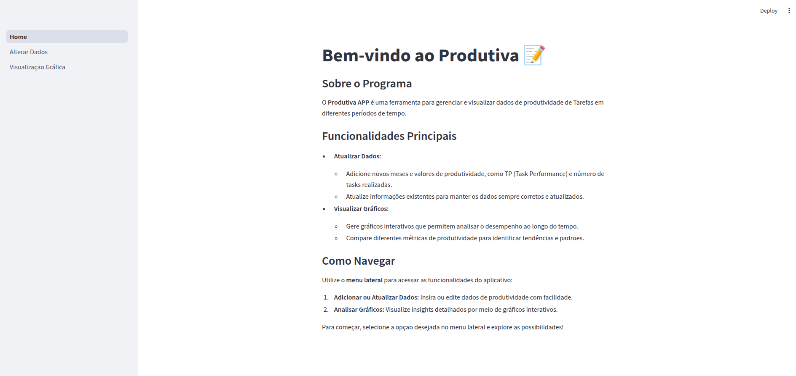 |
| ------------------------ |

## Technologies Used

- Python 3.9+
- Streamlit
- Pandas
- Plotly
- OpenPyXL

## License

This project is licensed under the MIT License.

## Contact

- **GitHub:** /pedrorigon
- **Email:** phcrigon@inf.ufrgs.br
